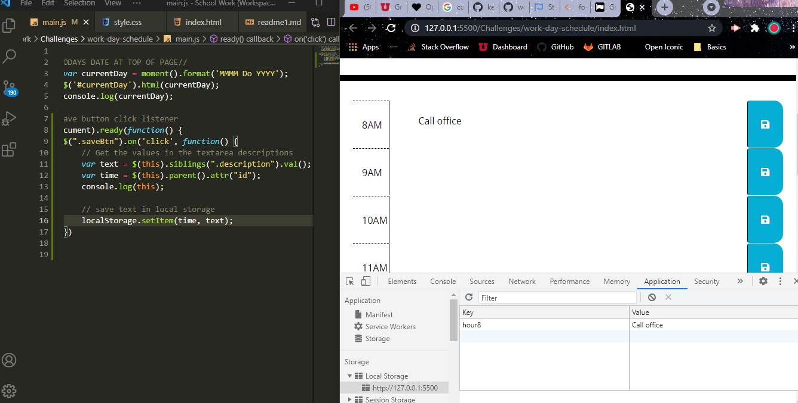
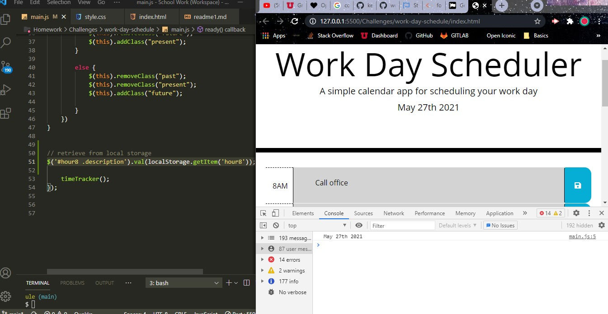

# Challenge 4- Timed Test Application 
> Work Day Planner!
---
### Table of Contents
- [Description](#description)
- [Introduction](#introduction)
- [Challenges](#challenges)
- [Victories](#victories)
- [Resources](#resources)

---

## Description

Challenge #5 - Work Day Planner

## Introduction 
This week we were challenged to add functionality to a work day agenda. We were challenged to add the date to the top of the page for it to be current each day. We were instructed to make the fields editable and then save our text when clicking the save button. We also needed our text to persist after 

---

## Challenges

Overall, after doing the javascript quiz last week, this challenge was worlds easier and actually pretty enjoyable. I absolutley love when you put code and you see your page come to life. 

---
## Victories

I struggled to get the localStorage set up and finally got that worked out, first to save the value and key in the local storage and then next to get it to populate on the page. 

---

## Resources 

<a href="https://github.com/kelleymarne/work-day-schedule">GitHub Repo</a>

<a href="https://www.youtube.com/watch?v=eVGEea7adDM"> YouTube</a>

<a href="https://www.google.com/webhp?hl=en&sa=X&ved=0ahUKEwiLjJ7fosLvAhWXW80KHawRD_oQPAgI">Google</a>

<a href="https://www.w3schools.com/charsets/ref_html_ascii.asp">w3 Schools</a>

